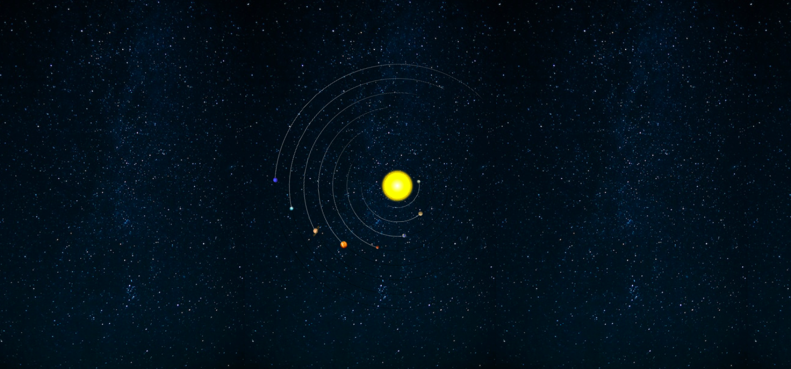

# Solar System 

This repository contains a simple website dedicated to the Solar System, featuring information and images of various planets.
You can access the site [here](http://programming-sai.github.io/SolarSystem/)

<p align="center">
    
</p>

## Installation

```bash

git clone https://github.com/Programming-Sai/SolarSystem.git

cd SolarSystem

# run it on local host.

```
## Files and Structure

### `index.html`

This is the main homepage of the website. It includes:

- A stylized representation of the Solar System using nested `div` elements and `section` tags for each planet.
- Each planet is represented by a small image (`20px x 20px`) within its respective section.
- Clicking on the Sun (`<div class="Sun"></div>`) navigates to the `Planets` page.

### `Planets.html`

This page serves as an overview of the planets in the Solar System. It includes:

- A header (`<header>`) with a logo and navigation menu (`<nav>`).
- Main content (`<main>`) featuring details about each planet:
  - Images of planets with brief descriptions.
  - Facts about the Solar System presented in an `<aside>` element.
- Footer (`<footer>`) with contact information and social media links.

### Stylesheets

- `Solar_System.css`: Stylesheet for the `index.html` page.
- `Planets.css`: Stylesheet for the `Planets.html` page.
- `fontawesome-free-6.4.0-web/css/all.css`: FontAwesome library for icons.

### Images

- Various planet images (`Images/`) used throughout both pages.
- Image files include `.png` and `.jpeg` formats, depicting planets, the Solar System, and related celestial objects.

## Usage

To view the website locally:

1. Clone or download the repository.
2. Open `index.html` or `Planets.html` in a web browser.

